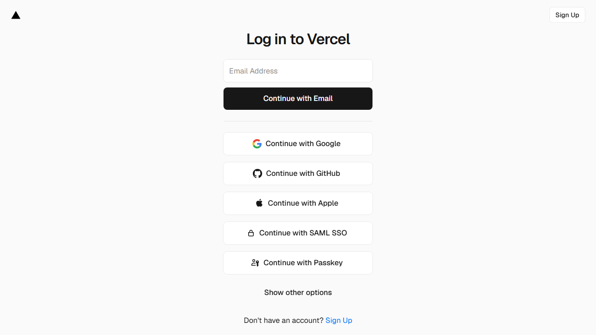
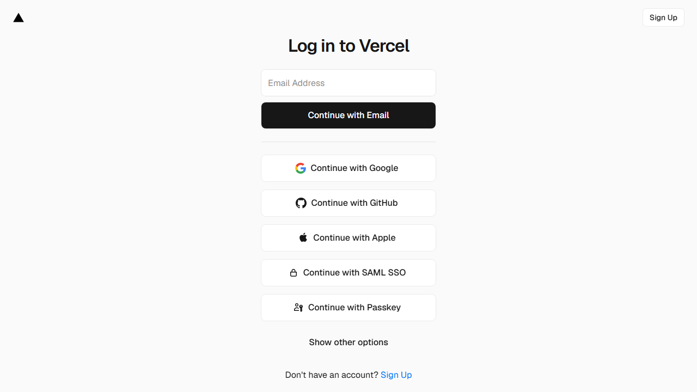
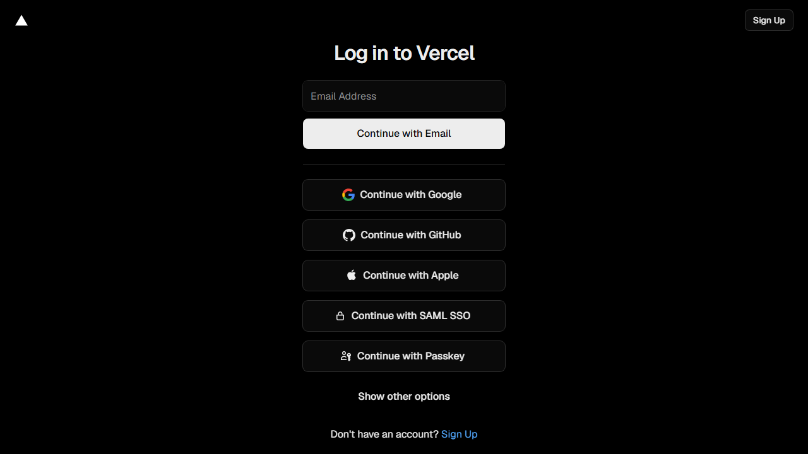
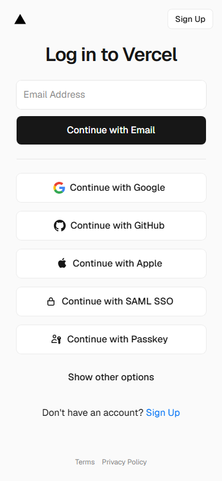

<p align="center">
  
</p>

<h1 align="center">MilkTea Iku</h1>

<p align="center">
  <strong>Premium Milk Tea E-Commerce Platform</strong><br/>
  <em>Trà Sữa Cao Cấp &bull; プレミアムミルクティー</em>
</p>

<p align="center">
  <a href="https://milktea-iku.vercel.app">
    
  </a>
</p>

<p align="center">
  <a href="https://github.com/JasonTM17/MilkTea_Iku/releases/tag/v1.0.0">
    
  </a>
  <a href="https://github.com/JasonTM17/MilkTea_Iku/blob/main/LICENSE">
    
  </a>
  <a href="https://github.com/JasonTM17/MilkTea_Iku/commits/main">
    
  </a>
  <a href="https://hub.docker.com/r/nguyenson1710/milktea-iku-backend">
    
  </a>
  <a href="https://hub.docker.com/r/nguyenson1710/milktea-iku-frontend">
    
  </a>
</p>

<p align="center">
  
  
  
  
  
  
</p>

---

<p align="center"></p>

## Screenshots & Demo

<table>
  <tr>
    <td align="center"><strong>Homepage</strong></td>
    <td align="center"><strong>Menu</strong></td>
    <td align="center"><strong>Dark Mode</strong></td>
  </tr>
  <tr>
    <td></td>
    <td></td>
    <td></td>
  </tr>
  <tr>
    <td align="center" colspan="3"><strong>Mobile</strong></td>
  </tr>
  <tr>
    <td align="center" colspan="3"></td>
  </tr>
</table>

<details>
<summary><strong>Demo GIF</strong> (click to expand)</summary>
<br/>
<p align="center">
  <em>Full ordering flow: Browse → Customize → Cart → Checkout</em>
</p>

> Record a screen capture of the ordering flow and replace this section with the GIF.
> Recommended tool: [LICEcap](https://www.cockos.com/licecap/) or [Kap](https://getkap.co/)

</details>

---

<p align="center"></p>

## Features

<table>
  <tr>
    <td>
      
      <br/><br/>
      <strong>Product Catalog</strong> — Browse by category, search, filter<br/>
      <strong>Drink Builder</strong> — Size, sugar, ice, toppings customization<br/>
      <strong>Cart & Checkout</strong> — Persistent cart, form validation, order confirmation<br/>
      <strong>Order Tracking</strong> — Real-time delivery progress steps
    </td>
    <td>
      
      <br/><br/>
      <strong>Revenue Stats</strong> — Charts and analytics<br/>
      <strong>Order Management</strong> — Status updates, filtering<br/>
      <strong>Product CRUD</strong> — Add, edit, remove products<br/>
      <strong>Coupon System</strong> — Create and manage promotions
    </td>
  </tr>
  <tr>
    <td>
      
      <br/><br/>
      <strong>Dark Mode</strong> — Full theme support<br/>
      <strong>Responsive</strong> — Mobile-first with bottom nav<br/>
      <strong>Animations</strong> — Framer Motion throughout<br/>
      <strong>40+ Components</strong> — Reusable design system
    </td>
    <td>
      
      <br/><br/>
      <strong>PWA</strong> — Offline support, installable<br/>
      <strong>SEO</strong> — JSON-LD, sitemap, OG images<br/>
      <strong>Image Optimization</strong> — AVIF/WebP, lazy loading<br/>
      <strong>Code Splitting</strong> — Dynamic imports
    </td>
  </tr>
</table>

---

<p align="center"></p>

## Quick Start

```bash
# Clone
git clone https://github.com/JasonTM17/MilkTea_Iku.git
cd MilkTea_Iku

# Install
npm ci --legacy-peer-deps

# Database
cp .env.example .env
npx prisma generate
npx prisma db push
npm run db:seed

# Run
npm run dev
```

Open [http://localhost:3000](http://localhost:3000)

---

<p align="center"></p>

## Architecture

```
src/
├── app/                    # Next.js App Router pages
│   ├── api/               # RESTful API routes (12+)
│   ├── admin/             # Admin dashboard
│   ├── menu/              # Product catalog
│   ├── checkout/          # Checkout flow
│   └── ...                # 20+ pages
├── components/            # 40+ React components
├── lib/                   # Utilities, validators, Prisma client
└── store/                 # Zustand state management
prisma/
├── schema.prisma          # Database schema
└── seed.ts               # Sample data
tests/
├── e2e/                  # End-to-end tests
├── api/                  # API integration tests
├── visual/               # Visual regression
└── accessibility/        # a11y tests
```

---

<p align="center"></p>

## Docker Deployment

```bash
# Using Docker Compose (recommended)
docker compose up -d

# Or pull from Docker Hub
docker pull nguyenson1710/milktea-iku-backend:v1.0.0
docker pull nguyenson1710/milktea-iku-frontend:v1.0.0
```

| Service | Image | Port | Size |
|---------|-------|------|------|
| Backend (Node.js + API) | `nguyenson1710/milktea-iku-backend` | 3000 | 349 MB |
| Frontend (Nginx + Static) | `nguyenson1710/milktea-iku-frontend` | 80 | 96 MB |

---

<p align="center"></p>

## API Reference

| Method | Endpoint | Description |
|--------|----------|-------------|
| `GET` | `/api/products` | List products (filter, search, paginate) |
| `GET` | `/api/products/[slug]` | Product detail |
| `GET` | `/api/categories` | List categories |
| `GET` | `/api/toppings` | List toppings |
| `POST` | `/api/orders` | Create order |
| `GET` | `/api/orders/tracking` | Track order by phone |
| `GET` | `/api/search` | Full-text search |
| `POST` | `/api/contact` | Submit contact form |
| `POST` | `/api/newsletter` | Subscribe to newsletter |
| `GET` | `/api/health` | Health check |
| `GET/PATCH` | `/api/admin/orders` | Admin order management |
| `GET` | `/api/admin/stats` | Dashboard statistics |

---

<p align="center"></p>

## Testing

```bash
# Run all tests
npx playwright test

# Specific suites
npx playwright test tests/e2e/
npx playwright test tests/api/
npx playwright test tests/visual/
npx playwright test tests/accessibility/

# With UI
npx playwright test --ui
```

---

<p align="center"></p>

## Scripts

| Command | Description |
|---------|-------------|
| `npm run dev` | Start development server |
| `npm run build` | Production build |
| `npm run start` | Start production server |
| `npm run lint` | Run ESLint |
| `npm run db:push` | Push schema to database |
| `npm run db:seed` | Seed sample data |
| `npm run db:studio` | Open Prisma Studio |

---

<p align="center"></p>

## Contributing

Contributions are welcome! See [CONTRIBUTING.md](CONTRIBUTING.md) for guidelines.

[](https://github.com/JasonTM17/MilkTea_Iku/pulls)
[](https://github.com/JasonTM17/MilkTea_Iku/issues)

---

<p align="center"></p>

## License

[MIT](LICENSE) &copy; 2026 [Nguyễn Sơn](https://github.com/JasonTM17)

---

<p align="center">
  <a href="https://github.com/JasonTM17">
    
  </a>
  <br/>
  <strong>Nguyễn Sơn</strong><br/>
  <em>Full-stack Developer</em>
  <br/><br/>
  <a href="https://github.com/JasonTM17">
    
  </a>
</p>

<p align="center">
  <sub>Made with ☕ and lots of 🧋</sub>
</p>

---

<details>
<summary><strong>Tiếng Việt</strong> 🇻🇳</summary>

## Giới Thiệu

**MilkTea Iku** là nền tảng thương mại điện tử trà sữa cao cấp, được xây dựng với công nghệ hiện đại nhất.

### Tính Năng Chính

- Danh mục sản phẩm với bộ lọc và tìm kiếm
- Tùy chỉnh đồ uống (size, đường, đá, topping)
- Giỏ hàng và thanh toán đầy đủ
- Theo dõi đơn hàng theo thời gian thực
- Bảng điều khiển quản trị
- Chế độ tối
- PWA hỗ trợ offline
- 20+ trang, 40+ component

### Cài Đặt Nhanh

```bash
git clone https://github.com/JasonTM17/MilkTea_Iku.git
cd MilkTea_Iku
npm ci --legacy-peer-deps
cp .env.example .env
npx prisma generate && npx prisma db push
npm run db:seed
npm run dev
```

### Docker

```bash
docker compose up -d
# Hoặc pull từ Docker Hub
docker pull nguyenson1710/milktea-iku-backend:v1.0.0
docker pull nguyenson1710/milktea-iku-frontend:v1.0.0
```

### Demo Trực Tuyến

[milktea-iku.vercel.app](https://milktea-iku.vercel.app)

</details>

<details>
<summary><strong>日本語</strong> 🇯🇵</summary>

## 概要

**MilkTea Iku** は、最新技術で構築されたプレミアムミルクティーECプラットフォームです。

### 主な機能

- カテゴリフィルターと検索付き商品カタログ
- ドリンクカスタマイズ（サイズ、甘さ、氷、トッピング）
- カートとチェックアウト
- リアルタイム注文追跡
- 管理ダッシュボード
- ダークモード対応
- PWAオフラインサポート
- 20以上のページ、40以上のコンポーネント

### クイックスタート

```bash
git clone https://github.com/JasonTM17/MilkTea_Iku.git
cd MilkTea_Iku
npm ci --legacy-peer-deps
cp .env.example .env
npx prisma generate && npx prisma db push
npm run db:seed
npm run dev
```

### Docker

```bash
docker compose up -d
# Docker Hubからプル
docker pull nguyenson1710/milktea-iku-backend:v1.0.0
docker pull nguyenson1710/milktea-iku-frontend:v1.0.0
```

### ライブデモ

[milktea-iku.vercel.app](https://milktea-iku.vercel.app)

</details>
