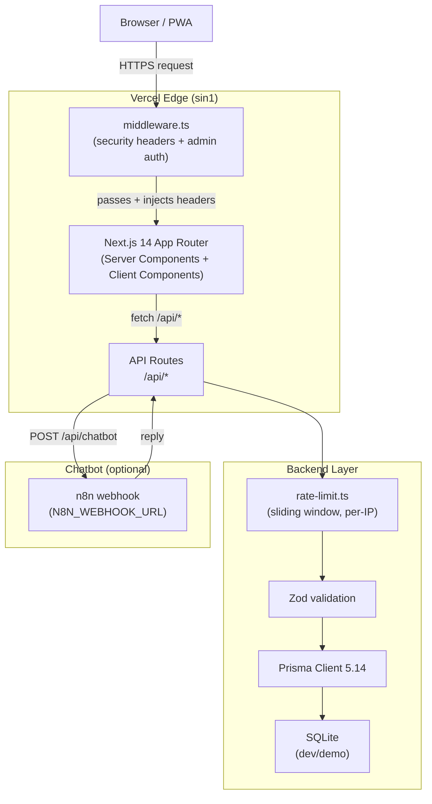
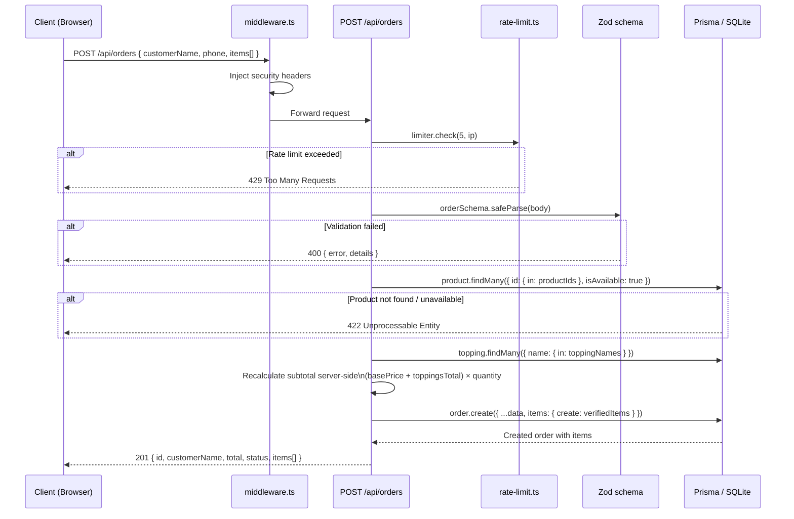

# Kiến trúc hệ thống — MilkTea Iku

> Last updated: 2026-05-17
> Author: Nguyễn Sơn (jasonbmt06@gmail.com)

---

> **30-second reviewer brief**
>
> Single-region Next.js 14 App Router monorepo deployed on Vercel (Singapore). All requests pass through `middleware.ts` for security headers and admin auth. Server Components fetch data directly via Prisma; Client Components call API routes. Every API route applies rate limiting → Zod validation → Prisma query. Database is SQLite for demo; a Postgres-ready schema and one-shot migration script are included. No user auth system — admin access uses HTTP Basic + Bearer with `timingSafeEqual` comparison.
>
> **Key files:** `src/middleware.ts` · `src/app/api/orders/route.ts` (price recompute) · `backend/lib/rate-limit.ts` · `backend/prisma/schema.postgres.prisma`

---

## Mục lục

1. [Sơ đồ tổng quan](#1-sơ-đồ-tổng-quan)
2. [Layered architecture](#2-layered-architecture)
3. [Cấu trúc thư mục](#3-cấu-trúc-thư-mục)
4. [Data flow — tạo đơn hàng](#4-data-flow--tạo-đơn-hàng)
5. [State management](#5-state-management)
6. [Authentication](#6-authentication)
7. [Caching strategy](#7-caching-strategy)
8. [Error handling](#8-error-handling)

---

## 1. Sơ đồ tổng quan



**Luồng chính:**
1. Mọi request đi qua `middleware.ts` — inject security headers, kiểm tra admin auth cho `/admin` và `/api/admin`.
2. Server Components fetch data trực tiếp qua Prisma (không qua API route).
3. Client Components gọi API routes qua `fetch`.
4. API routes áp dụng rate limiting → Zod validation → Prisma query → JSON response.

---

## 2. Layered architecture

| Layer | Trách nhiệm | Công nghệ chính |
|-------|-------------|-----------------|
| Presentation | UI rendering, routing, dark mode, PWA | Next.js 14 App Router, React 18, Tailwind CSS 3.4, Framer Motion 11 |
| State | Cart, wishlist, UI state phía client | Zustand 4.5 |
| API | REST endpoints, validation, auth guard | Next.js Route Handlers, Zod 3.23 |
| Security | Headers, rate limiting, input sanitization | `middleware.ts`, `rate-limit.ts`, `sanitize.ts` |
| Data access | ORM, schema, migrations | Prisma 5.14 |
| Database | Persistent storage | SQLite (dev/demo), PostgreSQL/MySQL (production) |
| Automation | Chatbot webhook | n8n (optional, self-hosted) |
| Infrastructure | Container orchestration, reverse proxy | Docker Compose, Nginx |
| CI/CD | Lint, typecheck, build, deploy, release | GitHub Actions, Vercel CLI |

---

## 3. Cấu trúc thư mục

```
MilkTea_Iku/
├── backend/
│   ├── lib/
│   │   ├── api-response.ts     # successResponse, errorResponse, paginatedResponse helpers
│   │   ├── constants.ts        # App-wide constants
│   │   ├── format.ts           # Formatting utilities (currency, date)
│   │   ├── logger.ts           # Console logger wrapper
│   │   ├── prisma.ts           # Prisma client singleton
│   │   ├── rate-limit.ts       # Sliding window rate limiter (60s / 500 tokens)
│   │   ├── sanitize.ts         # Input sanitization helpers
│   │   ├── utils.ts            # General utilities
│   │   └── validators.ts       # Shared Zod schemas (phoneSchema, etc.)
│   ├── n8n/
│   │   └── docker-compose.n8n.yml  # n8n standalone compose
│   └── prisma/
│       ├── schema.prisma       # Database schema (8 models)
│       ├── seed.ts             # Sample data seeder
│       └── dev.db              # SQLite database (gitignored)
├── frontend/
│   ├── components/             # 75+ React components
│   │   └── ui/                 # shadcn/ui primitives
│   ├── hooks/                  # Custom React hooks
│   └── store/                  # Zustand stores (cart, wishlist)
├── shared/
│   └── types/                  # Shared TypeScript interfaces
├── src/
│   ├── app/
│   │   ├── api/                # 31 API route handlers
│   │   │   ├── admin/          # Admin-only endpoints (auth required)
│   │   │   ├── products/       # Product catalog + reviews + recommendations
│   │   │   ├── orders/         # Order create, list, tracking, status
│   │   │   ├── coupons/        # Coupon validation
│   │   │   ├── chatbot/        # n8n webhook proxy
│   │   │   ├── contact/        # Contact form
│   │   │   ├── newsletter/     # Newsletter subscribe + admin list
│   │   │   ├── reviews/        # Product reviews
│   │   │   ├── search/         # Full-text search
│   │   │   ├── stats/          # Public stats
│   │   │   ├── toppings/       # Topping list
│   │   │   ├── wishlist/       # In-memory wishlist
│   │   │   ├── health/         # Health check
│   │   │   └── docs/           # OpenAPI 3.0 spec
│   │   ├── admin/              # Admin dashboard (auth-gated)
│   │   ├── menu/               # Product catalog + detail pages
│   │   ├── checkout/           # Multi-step checkout form
│   │   ├── orders/             # Order history
│   │   ├── tracking/           # Order tracking
│   │   └── ...                 # 35+ additional pages
│   ├── middleware.ts            # Edge middleware (headers + auth)
│   ├── app/layout.tsx          # Root layout (ThemeProvider, fonts)
│   └── app/page.tsx            # Homepage (Server Component)
├── tests/
│   ├── e2e/                    # End-to-end flows (17 spec files)
│   ├── api/                    # API integration tests (8 spec files)
│   ├── accessibility/          # a11y tests
│   ├── visual/                 # Screenshot regression
│   ├── performance/            # Lighthouse checks
│   ├── security/               # Security header tests
│   └── seo/                    # Meta tag validation
├── .github/workflows/
│   ├── ci.yml                  # Lint → typecheck → build → docker push
│   ├── deploy.yml              # Vercel production deploy
│   ├── docker-publish.yml      # GHCR publish on tag
│   └── release.yml             # GitHub Release với changelog
├── Dockerfile.backend          # Node.js standalone (Next.js SSR + API)
├── Dockerfile.frontend         # Nginx static + reverse proxy
├── docker-compose.yml          # backend + frontend + n8n
├── nginx.conf                  # Nginx config (proxy /api → backend)
└── vercel.json                 # Vercel config (region, headers, build command)
```

---

## 4. Data flow — tạo đơn hàng

Đây là flow phức tạp nhất, minh họa cách validation và server-side price recalculation hoạt động.



**Điểm quan trọng:** Client gửi `subtotal` nhưng server **bỏ qua giá trị đó** và tính lại từ `basePrice` trong DB. Điều này ngăn chặn giả mạo giá.

---

## 5. State management

| State | Nơi lưu | Công nghệ | Ghi chú |
|-------|---------|-----------|---------|
| Cart items | Client memory + localStorage | Zustand 4.5 | Persist qua `zustand/middleware` |
| Wishlist (client) | Client memory | Zustand 4.5 | Sync với `/api/wishlist` |
| Wishlist (server) | Server memory | In-memory Set | Reset khi server restart — không persistent |
| Theme (dark/light) | localStorage | next-themes 0.4 | Persist qua page reload |
| Product data | Server | Next.js Server Components | `force-dynamic` — không cache |
| Order data | Server | Prisma / SQLite | Persistent |

**Server Components** được dùng cho data fetching (product list, categories, toppings) để tránh client-side waterfall. **Client Components** chỉ dùng khi cần interactivity (cart, checkout form, dark mode toggle).

---

## 6. Authentication

Dự án dùng **HTTP Basic Auth** cho admin — không có hệ thống user accounts.

```
Admin routes: /admin/* và /api/admin/*
```

**Cơ chế:**

1. `middleware.ts` intercept mọi request đến `/admin` và `/api/admin`.
2. Kiểm tra `Authorization` header:
   - `Basic <base64(username:password)>` — so sánh với `ADMIN_USERNAME` và `ADMIN_PASSWORD` env vars.
   - `Bearer <token>` — so sánh với `ADMIN_API_TOKEN` env var.
3. Nếu không hợp lệ: trả về `401` với header `WWW-Authenticate: Basic realm="Admin"`.

**Không có:**
- User registration / login
- JWT / session tokens
- OAuth / SSO
- Role-based access control (RBAC)

**Guest checkout:** Khách hàng đặt hàng bằng tên và số điện thoại — không cần tài khoản.

---

## 7. Caching strategy

| Resource | Strategy | Lý do |
|----------|----------|-------|
| API routes với Prisma | `export const dynamic = "force-dynamic"` | Tránh stale data cho product list, categories, orders |
| Static assets (`/_next/static/*`) | `Cache-Control: public, max-age=31536000, immutable` | Content-hashed filenames — safe to cache forever |
| Public assets (`/public/*`) | `Cache-Control: public, max-age=2592000` | 30 ngày |
| Images | Next.js Image Optimization (`next/image`) | Automatic WebP/AVIF conversion, lazy loading |
| API docs | Không cache | Static JSON response, không cần cache |

Không có Redis cache hay CDN riêng. Vercel Edge Network xử lý CDN cho static assets.

---

## 8. Error handling

**API routes:**

Mọi API route wrap logic trong `try/catch`. Response shape nhất quán qua `api-response.ts`:

```ts
// Success
{ success: true, data: T, meta?: Record<string, unknown> }

// Error
{ success: false, error: string }

// Paginated
{ success: true, data: T[], meta: { total, page, limit, totalPages } }
```

Một số route cũ (trước khi refactor) dùng `NextResponse.json({ error })` trực tiếp — shape tương tự nhưng không có field `success`.

**Client-side:**

- `error.tsx` — Next.js error boundary cho route segments
- `not-found.tsx` — 404 page
- `react-hot-toast` — Toast notifications cho user-facing errors (cart, checkout, newsletter)

**Logging:**

`backend/lib/logger.ts` wrap `console.log/error/warn` với timestamp và context object. Không có remote logging service.

---

## Liên quan

- [`docs/DEPLOYMENT.md`](./DEPLOYMENT.md) — Triển khai và CI/CD
- [`docs/api.md`](./api.md) — API reference đầy đủ
- [`docs/HONEST_SCOPE.md`](./HONEST_SCOPE.md) — Giới hạn và phạm vi thực tế
