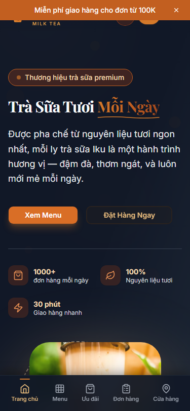

# Mobile Responsive — MilkTea Iku

> Last updated: 2026-05-17
> Author: Nguyễn Sơn (jasonbmt06@gmail.com)

---

<p align="center">
  
  &nbsp;&nbsp;
  
</p>
<p align="center">
  <em>iPhone 13 viewport (390×844) — light & dark, không horizontal overflow, touch targets ≥44px</em>
</p>

---

## Mục lục (Table of Contents)

1. [Mobile-first Approach](#1-mobile-first-approach)
2. [Common Layout Patterns](#2-common-layout-patterns)
3. [Mobile Navigation](#3-mobile-navigation)
4. [Responsive Images](#4-responsive-images)
5. [Safe Area Insets (iOS)](#5-safe-area-insets-ios)
6. [Overflow và Scroll](#6-overflow-và-scroll)
7. [Touch-friendly Spacing](#7-touch-friendly-spacing)
8. [Typography Responsive](#8-typography-responsive)

---

## 1. Mobile-first Approach

Tailwind CSS dùng mobile-first — class không có prefix áp dụng cho mọi kích thước, prefix `sm:`, `md:`, `lg:` ghi đè lên từ breakpoint đó trở lên.

### Nguyên tắc

- Viết style cho mobile trước, sau đó thêm breakpoint prefix để mở rộng
- Không viết style desktop trước rồi dùng `max-md:` để thu nhỏ

```tsx
// Đúng — mobile-first
<div className="flex flex-col gap-4 md:flex-row md:gap-8">

// Sai — desktop-first
<div className="flex flex-row gap-8 max-md:flex-col max-md:gap-4">
```

### Breakpoints của dự án

| Prefix | Min-width | Thiết bị mục tiêu |
|--------|-----------|-------------------|
| (none) | 0px | iPhone SE, Android nhỏ |
| `sm:` | 640px | iPhone Pro Max, Android lớn |
| `md:` | 768px | iPad, tablet |
| `lg:` | 1024px | iPad Pro, laptop nhỏ |
| `xl:` | 1280px | Desktop |
| `2xl:` | 1536px | Desktop lớn |

---

## 2. Common Layout Patterns

### Stack on mobile, grid on desktop

```tsx
// Product grid
<div className="grid grid-cols-2 sm:grid-cols-2 lg:grid-cols-3 xl:grid-cols-4 gap-4 md:gap-6">
  {products.map((p) => <ProductCard key={p.id} product={p} />)}
</div>

// Footer columns
<div className="grid grid-cols-1 md:grid-cols-2 lg:grid-cols-5 gap-10">
```

### Flex direction

```tsx
// Stack vertical on mobile, horizontal on md+
<div className="flex flex-col md:flex-row items-start md:items-center gap-4">

// Reverse order on mobile
<div className="flex flex-col-reverse md:flex-row gap-6">
```

### Container chuẩn

```tsx
// Luôn dùng pattern này cho full-width sections
<section className="w-full">
  <div className="max-w-7xl mx-auto px-4 sm:px-6 lg:px-8">
    {/* content */}
  </div>
</section>
```

### Hero section

```tsx
// Text size responsive
<h1 className="text-3xl sm:text-4xl md:text-5xl lg:text-6xl font-display font-bold">
  Trà Sữa Premium
</h1>

// Padding responsive
<section className="py-16 md:py-24 lg:py-32">
```

### Sidebar layout

```tsx
// Sidebar ẩn trên mobile, hiện trên lg+
<div className="flex flex-col lg:flex-row gap-8">
  <aside className="hidden lg:block w-64 flex-shrink-0">
    {/* filters */}
  </aside>
  <main className="flex-1 min-w-0">
    {/* content */}
  </main>
</div>
```

---

## 3. Mobile Navigation

Dự án có hai pattern navigation cho mobile:

### Sheet (Drawer) — Header mobile nav

Header dùng shadcn `Sheet` mở từ phải, chứa nav links và cart CTA:

```tsx
// Header.tsx pattern
<Sheet open={mobileOpen} onOpenChange={setMobileOpen}>
  <SheetTrigger className="md:hidden p-2 rounded-full" aria-label="Mở menu">
    <Menu className="w-5 h-5" />
  </SheetTrigger>
  <SheetContent side="right" className="w-[280px]">
    {/* nav links */}
  </SheetContent>
</Sheet>
```

### MobileNav — Bottom navigation bar

`MobileNav` component (mounted trong root layout) hiển thị bottom tab bar trên mobile:

- Chỉ hiển thị trên mobile (`md:hidden`)
- Cố định ở bottom với `fixed bottom-0`
- Cần `pb-safe` hoặc `padding-bottom: env(safe-area-inset-bottom)` cho iOS

```tsx
// MobileNav pattern
<nav className="fixed bottom-0 left-0 right-0 z-30 md:hidden bg-white dark:bg-gray-900 border-t border-border">
  <div className="flex items-center justify-around h-16 pb-safe">
    {/* tab items */}
  </div>
</nav>
```

### Khi nào dùng Sheet vs Bottom Nav

| Pattern | Dùng khi |
|---------|----------|
| Sheet (drawer) | Menu phụ, filter, cart — mở theo yêu cầu |
| Bottom Nav | Navigation chính — luôn visible trên mobile |

---

## 4. Responsive Images

### Luôn dùng Next.js `Image` component

```tsx
import Image from "next/image";

// Đúng — với sizes attribute
<Image
  src={product.image}
  alt={product.name}
  fill
  className="object-cover"
  sizes="(max-width: 640px) 50vw, (max-width: 1024px) 33vw, 25vw"
/>

// Sai — dùng  thông thường

```

### `sizes` attribute

`sizes` giúp browser chọn đúng kích thước ảnh để tải, tránh tải ảnh quá lớn trên mobile:

```tsx
// ProductCard — 2 cột mobile, 3 cột tablet, 4 cột desktop
sizes="(max-width: 640px) 50vw, (max-width: 1024px) 33vw, 25vw"

// Hero image — full width
sizes="100vw"

// Avatar nhỏ — fixed size
sizes="48px"

// Thumbnail trong cart — fixed size
sizes="80px"
```

### Aspect ratio

Dùng `aspect-ratio` để giữ tỷ lệ ảnh nhất quán:

```tsx
// Square product image
<div className="relative aspect-square overflow-hidden">
  <Image src={...} alt={...} fill className="object-cover" />
</div>

// 16:9 banner
<div className="relative aspect-video overflow-hidden">
  <Image src={...} alt={...} fill className="object-cover" />
</div>

// 4:3 card image
<div className="relative aspect-[4/3] overflow-hidden">
  <Image src={...} alt={...} fill className="object-cover" />
</div>
```

### Image fallback

```tsx
// Luôn có fallback khi ảnh null
src={product.image || "https://images.unsplash.com/photo-1558857563-b371033873b8?w=400"}

// Hoặc dùng onError handler
<Image
  src={product.image || "/placeholder.webp"}
  alt={product.name}
  onError={(e) => { e.currentTarget.src = "/placeholder.webp"; }}
/>
```

---

## 5. Safe Area Insets (iOS)

iPhone có notch và home indicator chiếm không gian. Cần padding để tránh content bị che.

### Root layout

```tsx
// body đã có overflow-x-hidden
<body className="antialiased bg-cream-50 dark:bg-gray-900 overflow-x-hidden">
```

### Bottom navigation

```tsx
// Thêm padding bottom cho safe area
<nav className="fixed bottom-0 left-0 right-0 pb-[env(safe-area-inset-bottom)]">

// Hoặc dùng Tailwind plugin (nếu có)
<nav className="fixed bottom-0 left-0 right-0 pb-safe">
```

### Viewport meta tag

Next.js tự động thêm viewport meta. Đảm bảo không override:

```html
<!-- Next.js tự thêm, không cần thêm thủ công -->
<meta name="viewport" content="width=device-width, initial-scale=1" />
```

---

## 6. Overflow và Scroll

### Ngăn horizontal scroll

```tsx
// Root layout đã có
<body className="overflow-x-hidden">

// Thêm vào container nếu cần
<div className="overflow-x-hidden">
```

### Horizontal scroll cho carousel

```tsx
// Scrollable row với snap
<div className="flex gap-4 overflow-x-auto snap-x snap-mandatory scrollbar-hide pb-4">
  {items.map((item) => (
    <div key={item.id} className="flex-shrink-0 w-64 snap-start">
      {/* card */}
    </div>
  ))}
</div>
```

`scrollbar-hide` utility đã được định nghĩa trong `globals.css`:

```css
.scrollbar-hide {
  -ms-overflow-style: none;
  scrollbar-width: none;
}
.scrollbar-hide::-webkit-scrollbar {
  display: none;
}
```

### Scroll lock khi modal mở

shadcn Dialog và Sheet tự động lock scroll. Khi tạo custom modal:

```tsx
useEffect(() => {
  if (isOpen) {
    document.body.style.overflow = "hidden";
  } else {
    document.body.style.overflow = "";
  }
  return () => { document.body.style.overflow = ""; };
}, [isOpen]);
```

---

## 7. Touch-friendly Spacing

### Minimum spacing giữa interactive elements

Trên mobile, các interactive elements cần đủ khoảng cách để tránh mis-tap:

```tsx
// Nav links trong mobile sheet — đủ padding
<Link className="flex items-center gap-3 px-4 py-3 rounded-xl ...">
  {/* py-3 = 12px top + 12px bottom + text ≈ 44px total */}
</Link>

// Buttons trong form — đủ height
<Button className="h-11 w-full">  {/* h-11 = 44px */}

// List items — đủ padding
<li className="py-3 px-4">  {/* tối thiểu 44px height */}
```

### Gap giữa buttons

```tsx
// Đủ gap để tránh mis-tap
<div className="flex gap-3">
  <Button>Hủy</Button>
  <Button>Xác nhận</Button>
</div>
```

### Form inputs trên mobile

```tsx
// Input đủ lớn để tap
<input className="h-11 px-4 text-base rounded-lg w-full" />
// text-base (16px) ngăn iOS auto-zoom khi focus
```

---

## 8. Typography Responsive

### Heading scale responsive

```tsx
// H1 — trang chủ hero
<h1 className="text-3xl sm:text-4xl md:text-5xl lg:text-6xl font-display font-bold">

// H2 — section heading
<h2 className="text-2xl sm:text-3xl md:text-4xl font-display font-bold">

// H3 — card title, sub-section
<h3 className="text-lg sm:text-xl font-semibold">
```

### Line clamp cho mobile

```tsx
// Giới hạn text dài trên mobile
<p className="line-clamp-2 md:line-clamp-3 text-sm text-muted-foreground">
  {description}
</p>

// Product name — 1 dòng
<h3 className="line-clamp-1 text-sm font-semibold">
  {product.name}
</h3>
```

### Text size cho input (ngăn iOS zoom)

iOS tự động zoom khi input có `font-size < 16px`. Luôn dùng `text-base` (16px) cho input:

```tsx
<input
  className="text-base h-11 px-4 ..."
  type="text"
/>
```

---

## Related

- [ACCESSIBILITY.md](./ACCESSIBILITY.md) — Touch target requirements
- [DESIGN_SYSTEM.md](./DESIGN_SYSTEM.md) — Breakpoints, spacing scale
- [COMPONENT_RULES.md](./COMPONENT_RULES.md) — Image component rules
- [TESTING.md](./TESTING.md) — Mobile viewport testing với Playwright
