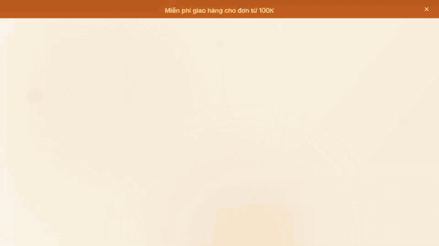
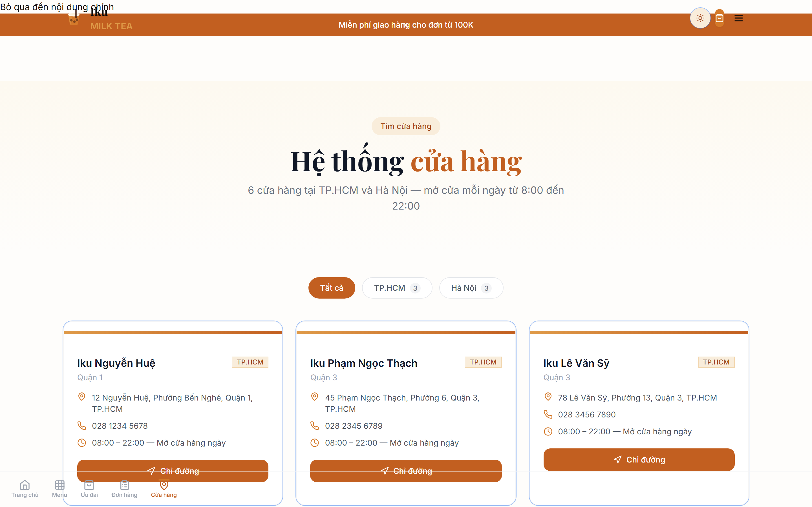
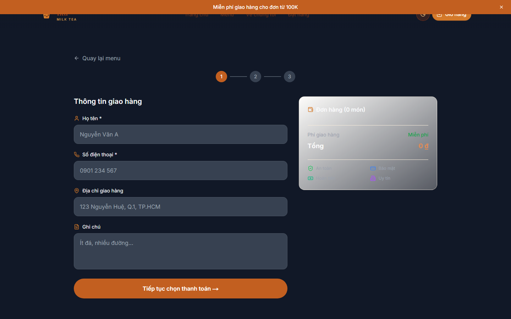
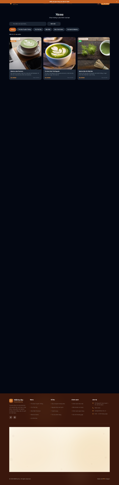
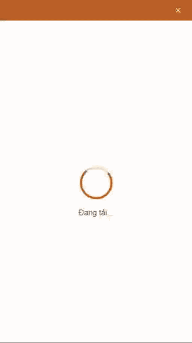
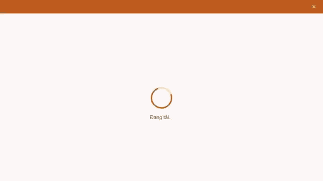

<p align="center">
  <a href="../README.md">English</a>
  &nbsp;·&nbsp;
  <a href="README.vi.md">Tiếng Việt</a>
  &nbsp;·&nbsp;
  <strong>日本語</strong>
</p>

<p align="center">
  
</p>

<h1 align="center">MilkTea Iku</h1>

<p align="center">
  <strong>フルスタック ミルクティー EC — Next.js 14 · TypeScript · Prisma · Docker</strong>
</p>

<p align="center">
  <a href="https://github.com/JasonTM17/MilkTea_Iku/actions/workflows/ci.yml">
    
  </a>
  <a href="https://github.com/JasonTM17/MilkTea_Iku/actions/workflows/codeql.yml">
    
  </a>
  <a href="https://github.com/JasonTM17/MilkTea_Iku/actions/workflows/security.yml">
    
  </a>
  <a href="https://github.com/JasonTM17/MilkTea_Iku/actions/workflows/deploy.yml">
    
  </a>
</p>

<p align="center">
  
  
  
  
  
  <a href="https://milktea-iku.vercel.app">
    
  </a>
  <a href="../LICENSE">
    
  </a>
</p>

---

## 30秒サマリー

MilkTea Ikuは、プレミアムミルクティーブランド向けのECストアフロントです。メニュー閲覧、ドリンクカスタマイズ、チェックアウト、注文追跡まで顧客の全体験をカバーし、注文・クーポン管理のための管理ダッシュボードも備えています。

> **📚 学習プロジェクト** — これはNguyễn Sơnの個人ポートフォリオプロジェクトです。コードベースは意図的にプロダクション仕様（実際の認証、実際のバリデーション、実際のCI/CD、実際のドキュメント）で構築されており、フルスタックパターンのリファレンスとして機能しますが、商用デプロイではありません。正確な範囲については[`HONEST_SCOPE.md`](HONEST_SCOPE.md)を参照してください。

|                |                                                                                             |
| -------------- | ------------------------------------------------------------------------------------------- |
| **ライブURL**  | [milktea-iku.vercel.app](https://milktea-iku.vercel.app)                                    |
| **ステータス** | Vercelにデプロイ済み · ポートフォリオ / リファレンス実装                                    |
| **スタック**   | Next.js 14 App Router, TypeScript, Prisma, SQLite (dev) / Postgres (prod)                   |
| **テスト**     | 35件のPlaywright specファイル — e2e, API, アクセシビリティ, ビジュアル, パフォーマンス, SEO |
| **CI/CD**      | 6つのGitHub Actionsワークフロー (ci, deploy, docker-publish, codeql, security, release)     |

---

## デモ

<p align="center">
  
  <br />
  <em>ホームページのライブツアー — ヒーロー、注目商品、店舗検索。</em>
</p>

## スクリーンショット

### デスクトップ

<table>
  <tr>
    <td width="50%" align="center">
      
      <br /><sub><b>ホームページ</b> · ライトモード</sub>
    </td>
    <td width="50%" align="center">
      
      <br /><sub><b>ホームページ</b> · ダークモード</sub>
    </td>
  </tr>
  <tr>
    <td align="center">
      
      <br /><sub><b>メニュー</b> · フィルター付き商品閲覧</sub>
    </td>
    <td align="center">
      
      <br /><sub><b>店舗</b> · ホーチミンとハノイの6拠点</sub>
    </td>
  </tr>
  <tr>
    <td align="center">
      
      <br /><sub><b>チェックアウト</b> · 注文と支払い</sub>
    </td>
    <td align="center">
      
      <br /><sub><b>メニュー</b> · ダークモード閲覧</sub>
    </td>
  </tr>
</table>

### モバイル

<table>
  <tr>
    <td width="33%" align="center">
      
      <br /><sub><b>ライトモード</b></sub>
    </td>
    <td width="33%" align="center">
      
      <br /><sub><b>ダークモード</b></sub>
    </td>
    <td width="33%" align="center">
      
      <br /><sub><b>インタラクションデモ</b></sub>
    </td>
  </tr>
</table>

### インタラクション

<table>
  <tr>
    <td width="50%" align="center">
      
      <br /><sub><b>メニュー閲覧</b> · フィルター、ホバー、商品カード</sub>
    </td>
    <td width="50%" align="center">
      
      <br /><sub><b>テーマ切替</b> · スムーズなダークモード遷移</sub>
    </td>
  </tr>
</table>

---

## 機能

**カスタマー向け**

- カテゴリフィルター・全文検索・並び替えによるメニュー閲覧
- ドリンクカスタマイザー — サイズ、甘さ、氷、複数トッピング選択
- 永続的な状態管理のカート (Zustand + localStorage)
- Zodバリデーションとサーバーサイド価格再計算付きマルチステップチェックアウト
- レート制限付きバリデーションによるクーポン適用
- 電話番号と注文IDによる注文追跡
- ロイヤルティティアと報酬プログラム
- ウィッシュリスト

**プラットフォーム**

- 管理ダッシュボード — 注文管理、ステータス遷移、クーポンCRUD、集計統計
- `next-themes`によるライト/ダークテーマ (WCAG AAコントラスト)
- 完全レスポンシブ、モバイルファーストデザイン
- 多言語対応 (English · Tiếng Việt · 日本語)
- `/api/docs`でのOpenAPI 3.0仕様
- PWAマニフェストとService Workerスキャフォールド

---

## 技術スタック

| レイヤー       | 選択                                                         |
| -------------- | ------------------------------------------------------------ |
| フレームワーク | Next.js 14.2 (App Router, Server Components, ストリーミング) |
| 言語           | TypeScript 5.4                                               |
| スタイリング   | Tailwind CSS 3.4 + shadcn/ui                                 |
| アニメーション | Framer Motion 11                                             |
| テーマ         | next-themes                                                  |
| バリデーション | Zod 3.23                                                     |
| 状態管理       | Zustand 4.5                                                  |
| ORM / DB       | Prisma 5.14 — SQLite (dev) · Postgres (prod)                 |
| 認証           | HTTP Basic + Bearerトークン、scryptハッシュパスワード        |
| レート制限     | IP別スライディングウィンドウ (インメモリ)                    |
| アイコン       | lucide-react                                                 |
| テスト         | Playwright 1.60                                              |
| CI/CD          | GitHub Actions                                               |
| ホスティング   | Vercel (メイン) · Docker Hub                                 |

---

## クイックスタート

### ローカル開発

```bash
git clone https://github.com/JasonTM17/MilkTea_Iku.git
cd MilkTea_Iku

npm install --legacy-peer-deps

cp .env.example .env.local
# .env.local を編集 — 下記「環境変数」を参照

npx prisma generate --schema=backend/prisma/schema.prisma
npm run db:push
npm run db:seed

npm run dev
# → http://localhost:3000
```

### Docker (セルフホスト)

```bash
cp .env.example .env.local
# 値を入力

docker compose up -d
# → http://localhost:3000
```

### 便利なスクリプト

| コマンド                               | 用途                        |
| -------------------------------------- | --------------------------- |
| `npm run dev`                          | 開発サーバー起動            |
| `npm run build`                        | プロダクションビルド        |
| `npm run lint`                         | ESLint + Next lint          |
| `npx tsc --noEmit`                     | 型チェック                  |
| `npx playwright test`                  | 全テストスイート実行        |
| `npm run db:push`                      | スキーマをSQLiteに反映      |
| `npm run db:seed`                      | 参照データのシード          |
| `npm run db:studio`                    | Prisma Studio起動           |
| `node scripts/generate-admin-hash.mjs` | `ADMIN_PASSWORD_HASH`を生成 |

---

## 環境変数

`.env.example`を`.env.local`にコピーして値を入力してください。

| 変数                  | 必須    | 説明                                                        |
| --------------------- | ------- | ----------------------------------------------------------- |
| `DATABASE_URL`        | 必須    | dev用SQLiteパス; prod用PostgresURL                          |
| `ADMIN_USERNAME`      | 必須    | `/admin` HTTP Basic Auth用ユーザー名                        |
| `ADMIN_PASSWORD`      | devのみ | 平文パスワード (ハッシュ設定時は無視)                       |
| `ADMIN_PASSWORD_HASH` | prod    | scryptハッシュ — `generate-admin-hash.mjs`で生成            |
| `ADMIN_API_TOKEN`     | 必須    | プログラムによる管理アクセス用Bearerトークン                |
| `N8N_WEBHOOK_URL`     | 任意    | チャットボット用n8n webhook URL                             |
| `N8N_HOSTNAMES`       | 任意    | n8n用SSRFホワイトリスト                                     |
| `N8N_USER`            | 任意    | n8n basic authユーザー (docker-composeのみ)                 |
| `N8N_PASSWORD`        | 任意    | n8n basic authパスワード (docker-composeのみ)               |
| `E2E_BASE_URL`        | CIのみ  | Playwright用ベースURL (デフォルト: `http://localhost:3000`) |

---

## アーキテクチャ

完全なアーキテクチャ概要、プロジェクト構成、データフロー図: [`docs/ARCHITECTURE.md`](ARCHITECTURE.md)

追加ドキュメント:

| ドキュメント      | リンク                                            |
| ----------------- | ------------------------------------------------- |
| APIリファレンス   | [`docs/api.md`](api.md)                           |
| デプロイガイド    | [`docs/DEPLOYMENT.md`](DEPLOYMENT.md)             |
| テスト戦略        | [`docs/TESTING.md`](TESTING.md)                   |
| UI/UXガイドライン | [`docs/UI_UX_GUIDELINES.md`](UI_UX_GUIDELINES.md) |
| セキュリティ      | [`SECURITY.md`](../SECURITY.md)                   |
| 実際のスコープ    | [`docs/HONEST_SCOPE.md`](HONEST_SCOPE.md)         |

---

## デプロイ

### Vercel (メイン)

`main`にプッシュすると [`deploy.yml`](../.github/workflows/deploy.yml) ワークフローが自動的にビルド・デプロイします。

本番環境では、Vercelダッシュボードで全環境変数を設定し、`DATABASE_URL`をPostgres接続文字列に切り替えてください。

### Docker

```bash
docker compose up -d          # backend + frontend + n8n を起動
docker compose down           # 停止
docker compose logs -f        # ログをストリーミング
```

タグ付きリリースは [`docker-publish.yml`](../.github/workflows/docker-publish.yml) 経由でDocker Hubにイメージを自動公開します。

詳細リファレンス: [`docs/DEPLOYMENT.md`](DEPLOYMENT.md)

---

## 著者

**Nguyễn Sơn** — [github.com/JasonTM17](https://github.com/JasonTM17) · [jasonbmt06@gmail.com](mailto:jasonbmt06@gmail.com)

---

## ライセンス

[MIT](../LICENSE) © 2026 Nguyễn Sơn

---

<p align="center">Made with ☕ in Saigon</p>
